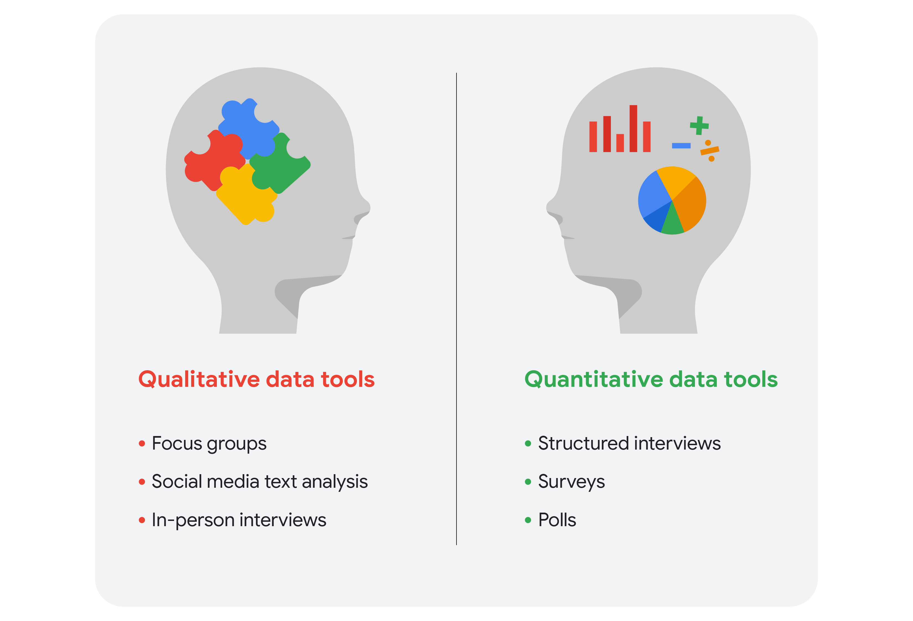

# Ask Questions to Make Data-Driven Decisions 

Course content

### 1. Asking effective questions: 
To do the job of a data analyst, you need to ask questions and problem-solve. In this part of the course, you’ll check out some common analysis problems and how analysts solve them. You’ll also learn about effective questioning techniques that can help guide your analysis.

### 2. Making data-driven decisions:
 In analytics, data drives decision making. In this part of the course, you’ll explore data of all kinds and its impact on decision making. You’ll also learn how to share your data through reports and dashboards.

### 3. Mastering spreadsheet basics: 
Spreadsheets are an important data analytics tool. In this part of the course, you’ll learn both why and how data analysts use spreadsheets in their work. You’ll also explore how structured thinking can help analysts better understand problems and come up with solutions. 

### 4. Always remembering the stakeholder: 
Successful data analysts learn to balance needs and expectations. In this part of the course, you’ll learn strategies for managing the expectations of stakeholders while establishing clear communication with your team to achieve your objectives.  
### 5. Completing the Course Challenge: 
At the end of this course, you will be able to put everything you have learned into practice with the Course Challenge. The Course Challenge will ask you questions about key principles you have been learning about and then give you an opportunity to apply those principles in three scenarios. 

## WEEK 1:

### From issue to action: The six data analysis phases :
There are six data analysis phases that will help you make seamless decisions: ask, prepare, process, analyze, share, and act. Keep in mind, these are different from the data life cycle, which describes the changes data goes through over its lifetime. Let’s walk through the steps to see how they can help you solve problems you might face on the job.

#### Step 1: Ask

It’s impossible to solve a problem if you don’t know what it is. These are some things to consider:

## WEEK 2:

### About:

 <li> Data Driven decision Making.
 <li> Data inspired decision Making.
  
Explores different data sources to find out what they have in common.
  
### Two types of Data 
  <li>  Qualitative Data
  <li> Quantitative Data
  
  
  

