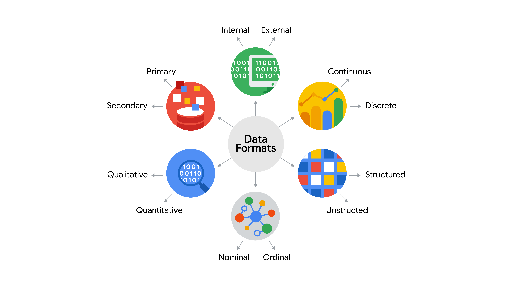
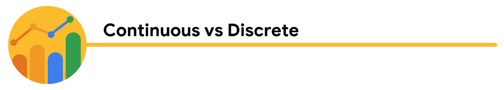

# Prepare Data For Exploration

Welcome to the third course in the Google Data Analytics Certificate! So far, you have been introduced to the field of data analytics and discovered how data analysts can use their skills to answer business questions. 

As a data analyst, you need to be an expert at structuring, extracting, and making sure the data you are working with is reliable. To do this, it is always best to develop a general idea of how all data is generated and collected, since every organization structures data differently. Then, no matter what data structure you are faced with in your new role, you will feel confident working with it.  

You will soon discover that when data is extracted, it isn’t perfect. It might be biased instead of credible, or dirty instead of clean. Your goal is to learn how to analyze data for bias and credibility and to understand what clean data means. You will also get up close and personal with databases and even get to extract your own data from a database using spreadsheets and SQL. The last topics covered are the basics of data organization and the process of protecting your data. 

And you will learn how to identify different types of data that can be used to understand and respond to a business problem. In this part of the program, you will explore different types of data and data structures. And best of all, you will keep adding to your data analyst tool box! From extracting and using data, to organizing and protecting it, these key skills will come in handy no matter what you are doing in your career as a data analyst.

## Course Content:

1. **Understanding data types and structures:** We all generate lots of data in our daily lives. In this part of the course, you will check out how we generate data and how analysts decide which data to collect for analysis. You’ll also learn about structured and unstructured data, data types, and data formats as you start thinking about how to prepare your data for exploration.

2. **Understanding bias,credibility,privacy,ethics, and acess:** When data analysts work with data, they always check that the data is unbiased and credible. In this part of the course, you will learn how to identify different types of bias in data and how to ensure credibility in your data. You will also explore open data and the relationship between and importance of data ethics and data privacy.

3. **Databases: Where data lives:** When you are analyzing data, you will access much of the data from a database. It’s where data lives. In this part of the course, you will learn all about databases, including how to access them and extract, filter, and sort the data they contain. You will also check out metadata to discover the different types and how analysts use them.

4. **Organizing and protecting your data:** Good organization skills are a big part of most types of work, and data analytics is no different. In this part of the course, you will learn the best practices for organizing data and keeping it secure. You will also learn how analysts use file naming conventions to help them keep their work organized.

## Week 1:

### How Data is Collected:

- Interviews
- Observations
- Forms
- Questionnaires
- Surveys
- Cookies

 #### Selecting the Right Data: 
 
1. **How the data will be collected:**

Decide if you will collect the data using your own resources or receive (and possibly purchase it) from another party. Data that you collect yourself is called first-party data.

2. **Data sources:**

If you don’t collect the data using your own resources, you might get data from second-party or third-party data providers. Second-party data is collected directly by another group and then sold. Third-party data is sold by a provider that didn’t collect the data themselves. Third-party data might come from a number of different sources.

3. **Solving your business problem:**

Datasets can show a lot of interesting information. But be sure to choose data that can actually help solve your problem question. For example, if you are analyzing trends over time, make sure you use time series data — in other words, data that includes dates.

4. **How much data to collect**

If you are collecting your own data, make reasonable decisions about sample size. A random sample from existing data might be fine for some projects. Other projects might need more strategic data collection to focus on certain criteria. Each project has its own needs. 

Time frame
If you are collecting your own data, decide how long you will need to collect it, especially if you are tracking trends over a long period of time. If you need an immediate answer, you might not have time to collect new data. In this case, you would need to use historical data that already exists. 
 
 

### Discover Data 

When we think about the word "format," a lot of things might come to mind. Think of an advertisement for your favorite store. You might find it in the form of a print ad, a billboard, or even a commercial. The information is presented in the format that works best for you to take it in. The format of a dataset is a lot like that, and choosing the right format will help you manage and use your data in the best way possible.

## Data Formats Example:

| Data Format Classification 	| Definition                                        	| Examples                                                                                                                                                                         	|
|----------------------------	|---------------------------------------------------	|----------------------------------------------------------------------------------------------------------------------------------------------------------------------------------	|
| Primary data               	| Collected by a researcher from first-hand sources 	| -  Data from an interview you conducted   -  Data from a survey returned from 20 participants    -  Data from questionnaires you got back from a group of workers    	|
| Secondary data             	| Gathered by other people or from other research   	| -  Data you bought from a local data analytics firm’s customer profiles  -  Demographic data collected by a university   -  Census data gathered by the federal government 	|

                                                                                                                                                                                                                                         

| Data Format Classification 	| Definition                                           	| Examples                                                                                                                                                       	|
|----------------------------	|------------------------------------------------------	|----------------------------------------------------------------------------------------------------------------------------------------------------------------	|
| Internal data              	| Data that lives inside a company’s own systems       	| - Wages of employees across different business units tracked by HR - Sales data by store location - Product inventory levels across distribution centers 	|
| External data              	| Data that lives outside of a company or organization 	| - National average wages for the various positions throughout your organization  - Credit reports for customers of an auto dealership                       	|

| Data Format Classification 	| Definition                                                  	| Examples                                                                                                                                             	|
|----------------------------	|-------------------------------------------------------------	|------------------------------------------------------------------------------------------------------------------------------------------------------	|
| Continuous data            	| Data that is measured and can have almost any numeric value 	| - Height of kids in third grade classes (52.5 inches, 65.7 inches)  - Runtime markers in a video  - Temperature                                	|
| Discrete data              	| Data that is counted and has a limited number of values     	| - Number of people who visit a hospital on a daily basis (10, 20, 200)  - Room’s maximum capacity allowed  - Tickets sold in the current month 	|

| Data Format Classification 	| Definition                                                           	| Examples                                                                                                                        	|
|----------------------------	|----------------------------------------------------------------------	|---------------------------------------------------------------------------------------------------------------------------------	|
| Qualitative                	| Subjective and explanatory measures of qualities and characteristics 	| - Exercise activity most enjoyed  - Favorite brands of most loyal customers  - Fashion preferences of young adults        	|
| Quantitative               	| Specific and objective measures of numerical facts                   	| - Percentage of board certified doctors who are women  - Population of elephants in Africa  - Distance from Earth to Mars 	|
