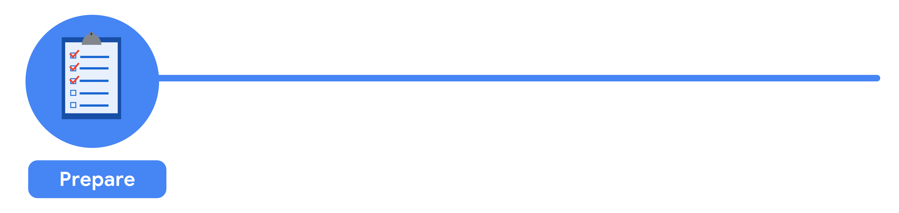

# Prepare Data For Exploration

Welcome to the third course in the Google Data Analytics Certificate! So far, you have been introduced to the field of data analytics and discovered how data analysts can use their skills to answer business questions. 

As a data analyst, you need to be an expert at structuring, extracting, and making sure the data you are working with is reliable. To do this, it is always best to develop a general idea of how all data is generated and collected, since every organization structures data differently. Then, no matter what data structure you are faced with in your new role, you will feel confident working with it.  

You will soon discover that when data is extracted, it isn’t perfect. It might be biased instead of credible, or dirty instead of clean. Your goal is to learn how to analyze data for bias and credibility and to understand what clean data means. You will also get up close and personal with databases and even get to extract your own data from a database using spreadsheets and SQL. The last topics covered are the basics of data organization and the process of protecting your data. 

And you will learn how to identify different types of data that can be used to understand and respond to a business problem. In this part of the program, you will explore different types of data and data structures. And best of all, you will keep adding to your data analyst tool box! From extracting and using data, to organizing and protecting it, these key skills will come in handy no matter what you are doing in your career as a data analyst.
